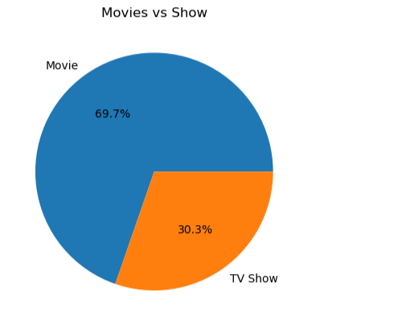

# Netflix Data Analysis

## 📌 Objective

Analyze Netflix dataset to identify trends in content, genres, and release patterns using data analytics techniques.

---

## ❓ Business Questions  

- What is the distribution of Movies vs TV Shows?  
- Which countries produce the most content?  
- How has Netflix content grown over the years?  
- Which genres are most popular?

---
 
## 🛠️ Tools Used

* Python (Pandas, NumPy)
* Matplotlib / Seaborn
* Jupyter Notebook
* Data Cleaning & Exploratory Data Analysis using Pandas

---

## 📂 Dataset

* Source: Kaggle Netflix Dataset
* Contains information about movies, TV shows, genres, release year, and country

---

## 🔍 Steps Performed

* Data Cleaning (handled missing values and duplicates)
* Data Transformation and preprocessing
* Exploratory Data Analysis (EDA)
* Data Visualization

---

## 📊 Key Insights

* Movies dominate Netflix content compared to TV shows
* Most content was added between 2017–2019
* USA and India are major contributors to content
* Drama and International genres are most popular

---

## 📈 Conclusion

This project demonstrates how data analytics techniques can be used to extract meaningful insights and support data-driven decision-making.

## 📊 Sample Visualization  

